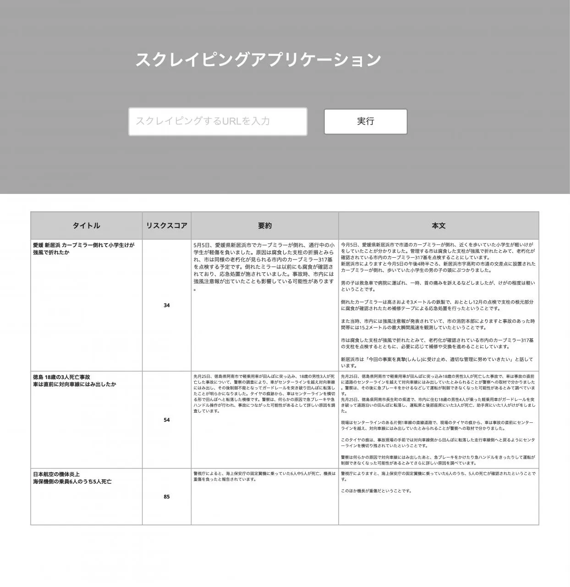

# Scraper App 🚀

**Yahoo!ニュース・@niftyニュースの記事をAIで自動分析する次世代ダッシュボード**

[](https://github.com/YOUR_USERNAME/scraper-app/actions)
[](https://codecov.io/gh/YOUR_USERNAME/scraper-app)
[](LICENSE)
[](https://www.python.org/downloads/)

> **⚠️ 免責事項**  
> 本プロジェクトは**技術デモンストレーション・学習目的**のポートフォリオです。  
> 実際の運用には各ニュースサイトの利用規約・robots.txt の確認と、著作権法の遵守が必要です。  
> 本コードの使用により生じた一切の損害について、作者は責任を負いません。



## ✨ ハイライト

### 🎨 モダンUI
- **ダークテーマ + グラスモーフィズム**: 最先端のデザインシステム
- **アニメーション**: 浮遊グロー、シマーエフェクト
- **レスポンシブ**: モバイルファースト設計
- **アクセシビリティ**: WCAG AA準拠

### 🤖 AI統合
- **OpenAI GPT-4**: 記事要約 + リスクスコアリング
- **自動推論**: スクレイピング直後にAI実行
- **履歴管理**: 推論履歴の完全トラッキング
- **リスク分類**: 5段階評価 (MINIMAL → CRITICAL)

### 📰 マルチソース対応
- **Yahoo!ニュース**: 9カテゴリRSS対応
- **@niftyニュース**: 6カテゴリRSS対応
- **横断検索**: 両サイトの記事を統合表示
- **自動取得**: トピックス→記事URL自動抽出

### 🔒 セキュリティ
- **CSRF保護**: 全フォームでトークン検証
- **SQLインジェクション対策**: SQLAlchemy ORM
- **XSS対策**: Jinja2自動エスケープ
- **セキュリティヘッダー**: CSP, HSTS, X-Frame-Options

### 🚀 CI/CD
- **GitHub Actions**: 自動テスト・ビルド・デプロイ
- **Copilot Review**: AIによるコードレビュー
- **セキュリティスキャン**: Trivy, Bandit, Safety
- **マルチプラットフォーム**: amd64, arm64対応

### 📊 充実したテスト
- **76テストケース**: 全テスト成功 ✅
- **カバレッジ80%+**: 高品質保証
- **pytest + coverage**: 自動化テストスイート

## 🛠️ 技術スタック

### Backend
- **Framework**: Flask 3.0+
- **ORM**: SQLAlchemy 2.0+
- **Migration**: Alembic
- **DB**: PostgreSQL (production), SQLite (dev)
- **AI**: OpenAI API (GPT-4)

### Frontend
- **Template**: Jinja2
- **Styling**: Modern CSS (Glassmorphism, Gradients, Animations)
- **Icons**: CSS-based
- **Design**: Mobile-First, Responsive Grid

### Infrastructure
- **Server**: Gunicorn + Nginx
- **Container**: Docker + Docker Compose
- **CI/CD**: GitHub Actions
- **Security**: Trivy, Bandit, Safety

### Development
- **Testing**: pytest, pytest-cov
- **Linting**: Ruff, Black, isort
- **Type Check**: mypy
- **Security**: Bandit, Safety

## 📁 プロジェクト構造

```
scraper-app/
├── app/
│   ├── auth/              # 認証・セッション管理
│   ├── models/            # SQLAlchemyモデル
│   │   ├── article.py     # 記事モデル + AI推論結果
│   │   ├── user.py        # ユーザーモデル
│   │   └── db.py          # DB初期化
│   ├── services/          # ビジネスロジック
│   │   ├── scraping.py    # スクレイピングエンジン
│   │   ├── parsing.py     # Yahoo!ニュースパーサー
│   │   ├── nifty_news.py  # @niftyニュースパーサー
│   │   ├── articles.py    # 記事管理サービス
│   │   ├── ai.py          # OpenAI統合
│   │   ├── risk.py        # リスク分類ロジック
│   │   ├── news_feed.py   # RSS取得
│   │   └── analytics.py   # メトリクス集計
│   ├── templates/         # Jinja2テンプレート
│   │   ├── layout.html    # ベースレイアウト
│   │   ├── index.html     # ダッシュボード
│   │   ├── result.html    # 記事詳細
│   │   └── login.html     # ログイン画面
│   ├── static/
│   │   └── styles.css     # モダンCSS (1584 lines)
│   ├── routes.py          # ルーティング
│   └── __init__.py        # Flaskアプリ初期化
├── cli/                   # CLI管理コマンド
├── deploy/                # デプロイ設定
├── docs/                  # ドキュメント
│   ├── UI_DESIGN.md       # UIデザインガイド
│   └── CI_CD.md           # CI/CDガイド
├── ml/                    # 機械学習（将来拡張）
├── tests/                 # テストスイート (76 tests)
├── .github/
│   └── workflows/
│       ├── ci-cd.yml      # CI/CDパイプライン
│       └── code-review.yml # Copilotレビュー
├── requirements.txt
├── pyproject.toml
├── pytest.ini
└── README.md
```

## 🚀 クイックスタート

### 前提条件

- Python 3.11+ ([pyenv推奨](https://github.com/pyenv/pyenv))
- PostgreSQL 15+ (開発はSQLiteでもOK)
- OpenAI APIキー ([取得方法](https://platform.openai.com/api-keys))

### インストール

```bash
# リポジトリクローン
git clone https://github.com/YOUR_USERNAME/scraper-app.git
cd scraper-app

# 仮想環境作成
python -m venv venv
source venv/bin/activate  # Windows: venv\Scripts\activate

# 依存関係インストール
pip install -r requirements.txt

# 環境変数設定
cp .env.example .env
# .env を編集してOpenAI APIキーなどを設定
```

### 環境変数

`.env` ファイルに以下を設定:

```bash
# Flask
FLASK_ENV=development
SECRET_KEY=your-secret-key-here

# Database
DATABASE_URL=sqlite:///local.db  # または postgresql://...

# OpenAI API
OPENAI_API_KEY=sk-...
ENABLE_AI=true

# RSS Feeds
ENABLED_FEED_PROVIDERS=yahoo,nifty

# 認証 (Basic Auth)
BASIC_AUTH_USERNAME=admin
BASIC_AUTH_PASSWORD=secure-password

# API Access (optional)
API_ACCESS_TOKENS=token1,token2
```

### データベース初期化

```bash
# マイグレーション実行
flask db upgrade

# 初期ユーザー作成（オプション）
flask auth create-user admin password123
```

### 起動

```bash
# 開発サーバー起動
flask run --debug

# または Gunicorn (本番想定)
gunicorn -w 4 -b 0.0.0.0:8000 "app:create_app()"
```

アプリケーションは http://localhost:5000 で起動します。

### Docker で起動

```bash
# イメージビルド
docker-compose build

# コンテナ起動
docker-compose up -d

# ログ確認
docker-compose logs -f web
```
python -m venv .venv
source .venv/bin/activate
pip install -r requirements.txt
cp .env.example .env
```

`.env` に下記必須項目を設定してください。

```
FLASK_ENV=development
DATABASE_URL=sqlite:///local.db
BASIC_AUTH_USERNAME=admin
BASIC_AUTH_PASSWORD=change_me
OPENAI_API_KEY=sk-...
```

### 3. 初期化

```bash
flask --app app.main db upgrade   # 初回のみ
flask --app app.main seed sample  # サンプルデータ投入 (任意)
```

### 4. 開発サーバー起動

```bash
flask --app app.main run
# or
make dev
```

ブラウザで `http://localhost:5000` を開き、先ほど設定した認証情報でログインします。

### 5. テストと品質チェック

```bash
pytest
pytest --cov=app --cov-report=term-missing   # カバレッジ表示
ruff check .                                  # Lint (導入済みの場合)
black .                                      # 整形 (導入済みの場合)
```

## 📖 使い方

### ダッシュボード

1. **最新ニュース閲覧**
   - Yahoo!/Niftyの両方から横断的に取得
   - 9カテゴリ × 複数メディア = 600+ 記事
   - ワンクリックでAI解析実行

2. **記事スクレイピング**
   - URLを入力して「実行する」ボタン
   - 自動的に記事内容取得 + AI要約・リスク評価
   - 重複チェック機能付き

3. **リスク監視**
   - 登録済み記事数、AI解析率
   - 平均リスクスコア、高リスク記事数
   - リスク分布（5段階）をグラフ表示

4. **検索・フィルタ**
   - キーワード検索（タイトル・本文）
   - 期間指定（開始日・終了日）
   - リスクレベル絞り込み
   - ソート（公開日時・登録日時・タイトル）

5. **CSV エクスポート**
   - 検索結果をCSV形式でダウンロード
   - Excel / Google Sheets で分析可能

### CLI コマンド

```bash
# RSS から記事を取得してスクレイプ
flask scrape-feed --limit 10 --provider yahoo

# 既存記事に対してAI推論を実行
flask ai rerun --article-id <ID>

# CSV エクスポート
flask export-csv --output articles.csv

# ユーザー管理
flask auth create-user <username> <password>
flask auth list-users
```

### API 利用

#### 認証

**Basic Auth**:
```bash
curl -u admin:password http://localhost:5000/api/articles
```

**Bearer Token**:
```bash
curl -H "Authorization: Bearer YOUR_TOKEN" \
     http://localhost:5000/api/articles
```

**API Key Header**:
```bash
curl -H "X-API-Key: YOUR_TOKEN" \
     http://localhost:5000/api/articles
```

#### エンドポイント

**記事一覧取得**:
```bash
GET /api/articles?page=1&per_page=20&q=keyword&risk=high
```

**記事スクレイプ**:
```bash
POST /api/articles
Content-Type: application/json

{
  "url": "https://news.yahoo.co.jp/articles/...",
  "force": false,
  "run_ai": true
}
```

**メトリクス取得**:
```bash
GET /api/reports/summary
```

### リクエスト例

```bash
curl -u admin:password \
  -H "Content-Type: application/json" \
  -d '{"url": "https://news.yahoo.co.jp/articles/example", "force_ai": true}' \
  http://localhost:5000/api/articles

curl -H "Authorization: Bearer my-token" \
  http://localhost:5000/api/articles
```

## CLIユーティリティ

```bash
flask --app app.main scrape feed   # RSSで最新記事をまとめて取得
flask --app app.main ai rerun      # 古い記事に対してAIを再実行
flask --app app.main export csv    # 分析用CSVエクスポート
```

詳細は `cli/` ディレクトリの実装や `flask --app app.main --help` を参照してください。

## MLワークフロー

`ml/` ディレクトリに学習・評価スクリプトとサンプルデータが同梱されています。自前データで再学習する場合は以下を参考にしてください。

```bash
python ml/train.py --train ml/data/train.csv --valid ml/data/valid.csv
python ml/evaluate.py --valid ml/data/valid.csv
```

モデルのハイパーパラメータや特徴量設計を調整し、`app/services/ai.py` から呼び出す推論ロジックを差し替えることで、独自のリスクスコアリングに対応できます。

## Dockerでの起動

### 開発環境

ホットリロード対応の開発環境を起動:

```bash
docker-compose -f docker-compose.dev.yml up --build
```

アクセス先:
- アプリケーション: http://localhost:5000
- pgAdmin (DB管理): http://localhost:5050
- PostgreSQL: localhost:5433

### 本番環境

本番環境用の構成で起動:

```bash
# 環境変数を設定
cp .env.example .env
# .env を編集して必要な値を設定

# 起動
docker-compose up -d --build
```

アクセス先:
- アプリケーション: http://localhost:8080
- Nginx (リバースプロキシ): http://localhost:80

### イメージのビルドのみ

```bash
docker build -t scraper-app:latest .
```

## CI/CD

GitHub Actions による自動テスト・ビルド・デプロイパイプラインを構築済み:

- **テスト**: pytest + PostgreSQL サービスコンテナ
- **Lint**: ruff, black, isort によるコード品質チェック
- **ビルド**: Docker イメージを GitHub Container Registry にプッシュ
- **デプロイ**: main ブランチへのマージ時に自動デプロイ（要設定）

ワークフロー: `.github/workflows/ci-cd.yml`

## デプロイガイド

### 従来の方法（EC2 + systemd）

- `deploy/nginx.conf`: リバースプロキシ設定例
- `deploy/scraper-app.service`: systemd ユニット (Gunicornを想定)
- `deploy/buildspec.yml`: AWS CodeBuild 用設定
- `deploy/deploy.sh`: build artifact を EC2 に配布し、サービス再起動まで自動化

### Docker を使った方法（推奨）

```bash
# EC2 インスタンスで
git clone <repository>
cd scraper-app
cp .env.example .env
# .env を編集
docker-compose up -d --build
```

## 制作背景とアピールポイント

- **課題意識**: ニュース記事の氾濫によりリスク情報の見逃しが増えている。企業のリスク管理部門向けに即時判定可能なツールを想定。
- **工夫した点**: スクレイピングからAI推論までの一貫したエラーハンドリング、再実行性、キャッシュ戦略を丁寧に設計。
- **UI/UX**: ダッシュボードとログイン画面を含む全体をガラス感のあるデザインで統一。レスポンシブ対応済み。
- **品質確保**: pytestベースの自動テストとレートリミット・認証制御を導入し、実サービスでも安全に扱える構成。
- **拡張性**: RSS以外のソース追加、Slack通知、BIツール連携などを容易に追加できる抽象化を実装。

## 今後のロードマップ

- Slack / Teams 連携によるアラート配信
- 自動スクレイピングスケジューラ (Celery + Beat)
- リアルタイムダッシュボード (WebSocket/Server-Sent Events)
- マルチユーザー対応と権限管理
- Docker Compose + Terraform を使った IaC 化

## ライセンス

MIT License

---

質問や改善案があれば Issues や Pull Request で気軽に連絡してください。
